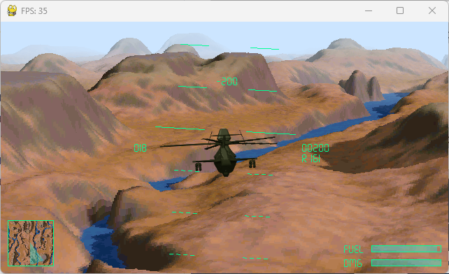

# VOXEL SKIES

A small helicopter simulator heavily inspired by Comanche: Maximum Overkill, published in 1992 by Novalogic.

This seminal game introduced the concept of the voxel rendering engine.

Your mission is simple: find the nearest landing zone and land to move on to the next level. To help you, you can use the distance displayed in the bottom right-hand corner of the HUD.

The core renderer used in this project has been developed by Stanislas Petrov and can be found here : https://github.com/StanislavPetrovV/Voxel-Space-Render

For the theory and maps, I used this other repository: https://github.com/StanislavPetrovV/Voxel-Space-Render

I don't intend to develop an arcade game, but rather a small flight simulator with a very basic flight model, for fun and to learn Python.

## Shortcuts

| Key | Function |
|-----|----------|
| ESC | Quit |
| Left and Righ arrows | Roll |
| Up and Down arrows | Pitch |
| Z | Move Up |
| S | Move Down |
| Q | Slide left |
| D | Slide right |
| N | Night vision goggles |
| L | Load next map (debug) |

## Requirements

* pygame
* numpy
* numba

## To do

* [x] altitude / collision detection
* [x] damage model
* [x] targets ? no, this will be a simulation-oriented game
* [x] damages / energy bar
* [x] radar alt if close to the ground
* [x] music 
* [x] explosion
* [x] explosion sounds
* [ ] wind effects ?
* [x] landing zones
* [x] hovering effects
* [x] external HUD
* [x] sky dome
* [x] resizable window
* [x] intro screen
* [x] fuel consumption
* [x] infinite map

Known bugs / issues

* None

## Attribution

Helicopter sound:
https://freesound.org/people/Robinhood76/sounds/554511/ by Robinhood76

Intro music:
https://freesound.org/people/Timbre/sounds/561191/ by Timbre