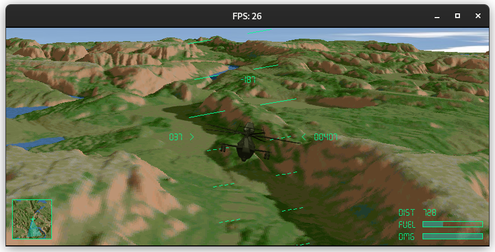

# VOXEL SKIES

A small helicopter simulator heavily inspired by Comanche: Maximum Overkill, published in 1992 by Novalogic.

This seminal game introduced the concept of the voxel rendering engine. 

The core renderer used in this project has been developed by Stanislas Petrov and can be found here : https://github.com/StanislavPetrovV/Voxel-Space-Render

For the theory and maps, I used this other repository: https://github.com/StanislavPetrovV/Voxel-Space-Render

I don't intend to develop an arcade game, but rather a small flight simulator with a very basic flight model, for fun and to learn Python.

## Shortcuts

| Key | Function |
|-----|----------|
| ESC | Quit |
| Left and Righ arrows | Roll |
| Up and Down arrows | Pitch |
| Z | Move Up |
| S | Move Down |
| Q | Slide left |
| D | Slide right |
| L | Load next map |
| N | Night vision goggles |

## Requirements

* pygame
* numpy
* numba

## To do

* [x] altitude / collision detection
* [x] damage model
* [x] targets ? no, this will be a simulation-oriented game
* [x] damages / energy bar
* [x] radar alt if close to the ground
* [ ] music / sound effects
* [x] explosion
* [ ] wind effects ?
* [ ] landing zones ?
* [x] hovering effects ?
* [x] external HUD
* [x] sky dome
* [x] fullscreen toggle
* [ ] intro screen
* [ ] end screen
* [ ] fuel consumption
* [ ] infinite map

Known bugs / issues

* None

## Attribution

Helicopter sound:
https://freesound.org/people/Robinhood76/sounds/554511/ by Robinhood76